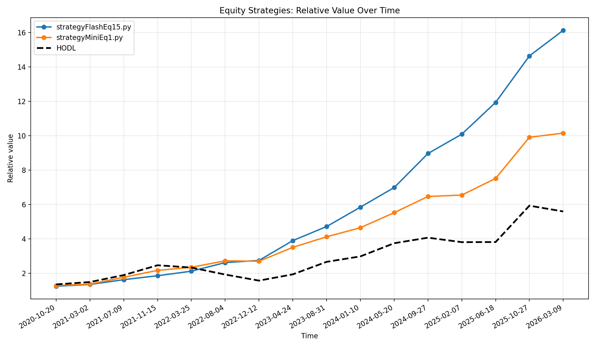
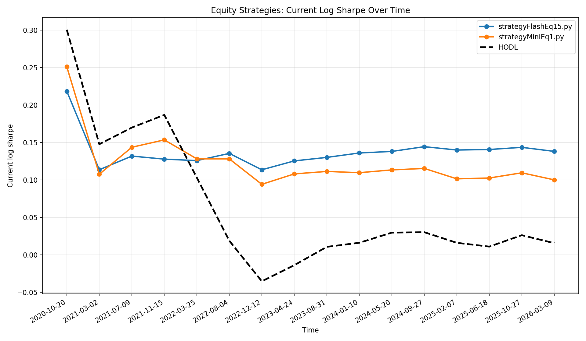
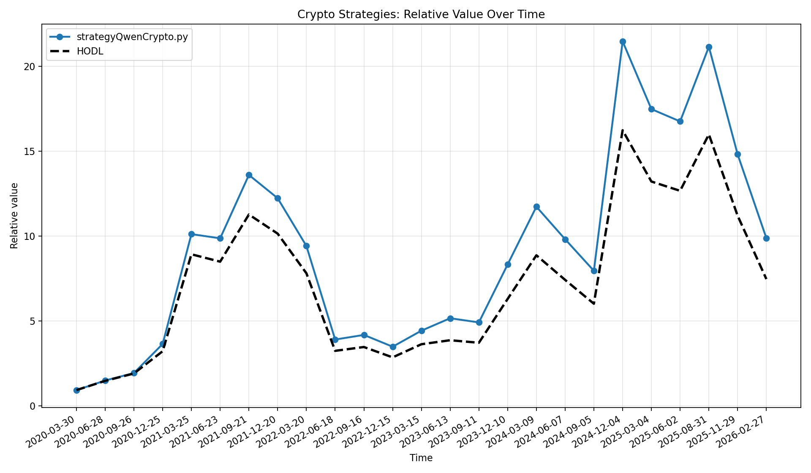
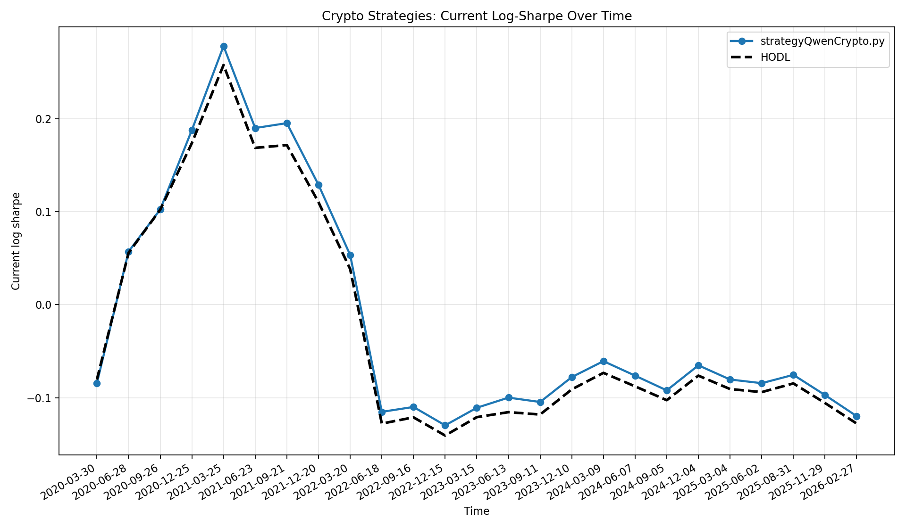

# Saved Strategy Results

This folder contains three strategies that were re-evaluated with `analyze_results.py` using the default setup:

- Equities: `AAPL`, `AMD`, `GOOGL`, `NVDA`
- Crypto: `BTC-USD`, `ETH-USD`, `XRP-USD`, `ADA-USD`
- Start date: `2019-01-01`

The charts below include a dashed `HODL` reference line. In the value charts, the y-axis is a relative value factor, not absolute cash.

One important point when reading these results: beating `HODL` is much harder than it first appears when the evaluation rewards risk-adjusted growth instead of raw return. In a strong bull market, `HODL` often wins simply by staying fully invested all the time and letting the major trend do the work. A strategy that tries to reduce drawdowns, sidestep volatility, or wait for cleaner entries may feel "safer", but it also spends more time out of the market. That missing exposure is expensive in runaway uptrends. As a result, a risk-aware strategy can look disciplined and still trail `HODL`, especially when the scoring uses a Sharpe-style penalty and the market keeps moving upward faster than the strategy can re-enter.

That trade-off is exactly why this folder is useful as more than just a showcase of what the current agent found. The framework is really a controlled test bench for strategy ideas. The agent can be replaced by anything that produces strategy code: another LLM, an evolutionary program synthesizer, a rules engine, a template library, or simply manual human invention. If you believe there is an easier way to beat `autoresearch-trading`, the cleanest way to check is to plug in a different strategy generation method and run it through the same walk-forward evaluation. That makes this repository a fair "beat the benchmark" challenge, not just a fixed AI demo.

## Strategy Overview

| File | Strategy | Market | Main idea | Final value | Log sharpe |
|---|---|---|---|---:|---:|
| `strategyFlashEq15.py` | `dpo_supertrend_adx_refined_v7` | Equity | Buy pullbacks inside strong uptrends, exit on reversal, ATR trail, or RSI profit-taking | 16.12M | 0.1381 |
| `strategyMiniEq1.py` | `dpo_williams_adx_regime_v2` | Equity | Buy oversold pullbacks in confirmed trends, exit with ATR trail plus percentage floor | 10.15M | 0.1000 |
| `strategyQwenCrypto.py` | `btc_patience_v11` | Crypto | Hold trend-following crypto positions with ADX-gated entries and adaptive ATR trailing exits | 9.88M | -0.1199 |

## Strategy Notes

### `strategyFlashEq15.py`

This equity strategy combines:

- `SuperTrend` for market direction
- `DPO` to identify pullbacks
- `ADX` to require a strong trend
- `ATR` for a trailing stop
- `RSI` for profit-taking

In practice, it waits for an uptrend, buys a dip inside that uptrend, and exits when the trend breaks, volatility expands against the position, or momentum becomes overextended.

### `strategyMiniEq1.py`

This equity strategy is a more compact trend-pullback system:

- `ADX` confirms that the market is trending
- `Williams %R` looks for oversold conditions
- `DPO` looks for a local cycle trough
- `EMA` keeps entries aligned with the broader trend
- `ATR` trail plus a percentage stop protect gains

It behaves like a disciplined “buy the dip in a healthy trend” model with dual stop logic on the exit.

### `strategyQwenCrypto.py`

This crypto strategy is slower and more patient:

- `ADX` is used as the main trend-strength filter
- `EMA` helps confirm the trend
- `ATR` defines a dynamic trailing stop
- `min_hold`, `cooldown_sell`, and `profit_buffer_pct` try to avoid getting chopped out too early

The design is meant to let strong crypto trends run while using wider, trend-aware exits than a typical short-term stop system.

## Equity Diagrams

### Relative Value

### Log Sharpe

## Crypto Diagrams

### Relative Value

### Log Sharpe

## Files

- `summary.tsv`: compact numerical summary of the latest run
- `details.json`: per-strategy fold-by-fold data used for plotting
- `analyze_results.log`: full analyzer log
- `*.png`: comparison charts for equity and crypto
